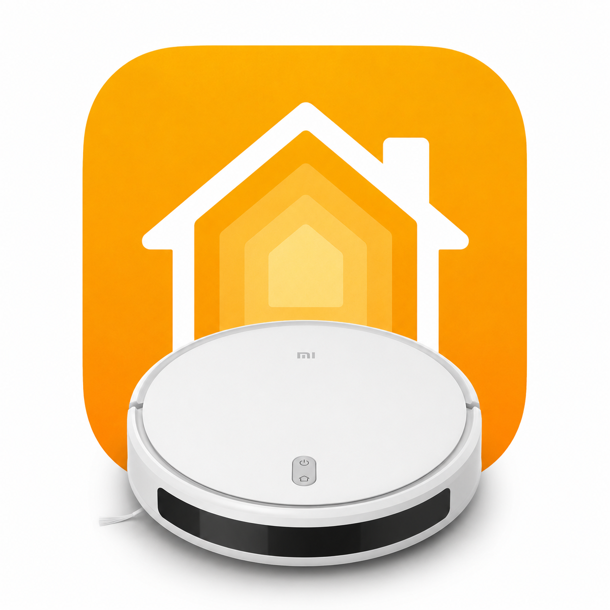

<h1 align="center">Homebridge Xiaomi 1C Vacuum</h1>

<p align="center">
  <a href="https://www.npmjs.com/package/homebridge-1c-matter"></a>
  <a href="LICENSE"></a>
  <a href="package.json"></a>
  <a href="https://homebridge.io/"></a>
  <a href="https://csa-iot.org/all-solutions/matter/"></a>
  <a href="#network-notes"></a>
</p>

<p align="center">
  
</p>

Matter-native Homebridge 2.0 plugin for Xiaomi Mi Robot Vacuum-Mop 1C using Local LAN control.

Published on npm as [`homebridge-1c-matter`](https://www.npmjs.com/package/homebridge-1c-matter).

## About
Homebridge Xiaomi 1C Vacuum brings the Xiaomi Mi Robot Vacuum-Mop 1C (`dreame.vacuum.mc1808`) into Apple Home as a native Matter robotic vacuum. It talks directly to the vacuum over your local network using Xiaomi's miIO/MIoT protocol, so day-to-day controls do not depend on Xiaomi Cloud.

The plugin focuses on the controls that make sense in Apple Home: start, pause, resume, return to dock, suction mode, battery, charging state, fault status, consumable status, Siri, scenes, and automations. Your existing Xiaomi map, no-go zones, and saved cleaning rules remain managed by the Mi Home app and are respected by the vacuum during normal whole-home cleans.

## Supported Models
This plugin is built and tested for the Xiaomi Mi Robot Vacuum-Mop 1C.

Known identifiers for the supported model:

- Xiaomi Mi Robot Vacuum-Mop 1C
- Xiaomi model `STYTJ01ZHM`
- Dreame/MIoT model `dreame.vacuum.mc1808`
- Hardware model `1C Vacuum (MC1808)`

Other Xiaomi, Mi, Dreame, or Roborock vacuums may use different local MIoT properties and actions. They are not currently supported unless a matching model profile is added.

## Features
- **Native HomeKit Vacuum Support:** Appears as a native vacuum in the Home app (iOS 18+ / Homebridge 2.0+).
- **Local Control:** Bypasses Xiaomi Cloud for instant response and better privacy.
- **Cleaning Controls:** Start cleaning, pause, resume, and return to dock.
- **Suction Modes:** Quiet, Default, Medium, and Strong cleaning modes.
- **Status Updates:** Reports idle, cleaning, paused, error, and returning-to-dock states.
- **Fault Labels:** Logs common vacuum fault codes with readable descriptions.
- **Find Vacuum:** Apple Home identify requests and the local check command can trigger the vacuum's locate prompt.
- **Consumable Status:** Logs main brush, side brush, and filter life when status changes.
- **Consumable Resets:** Local helper can reset main brush, side brush, and filter counters after replacement.
- **Power Status:** Reports battery percentage and charging/docked state.
- **Apple Home Automations:** Works with Siri, scenes, and Apple Home automations through Matter.
- **Local Connectivity Check:** Includes a command-line check to verify local IP, token, and device ID access before pairing.

## Installation
Install from npm: [homebridge-1c-matter](https://www.npmjs.com/package/homebridge-1c-matter)

1. Install Homebridge 2.0 or later.
2. Search for `homebridge-1c-matter` and install.
3. Obtain your vacuum's **IP Address** and **32-character Token**.

## Configuration
Add the following to your Homebridge `config.json`:

```json
{
  "platform": "OneCMatter",
  "name": "OneCMatter",
  "ip": "10.11.3.248",
  "token": "YOUR_32_CHARACTER_TOKEN",
  "deviceId": "YOUR_DEVICE_ID",
  "pollInterval": 30,
  "connectAttempts": 5
}
```

### How to get your Token
You can use the **[Xiaomi-Cloud-Tokens-Extractor](https://github.com/PiotrMachowski/Xiaomi-Cloud-Tokens-Extractor)** to easily get the IP, Token, and Device ID for all your Xiaomi devices.

## Network Notes
This plugin talks directly to the vacuum over the local Xiaomi miIO protocol on UDP port `54321`.

If Homebridge and the vacuum are on the same VLAN/subnet, no special network rules should normally be required.

If they are on different VLANs or subnets, basic ping may work while miIO still times out. Allow the Homebridge host to reach the vacuum on UDP `54321`. Some Xiaomi vacuums only respond reliably when the request appears to come from their own subnet; if a normal allow rule is not enough, add a tightly scoped source NAT/masquerade rule for this traffic.

| Setting | Value |
| :--- | :--- |
| Source | Homebridge host IP |
| Destination | Vacuum IP |
| Protocol | UDP |
| Destination Port | `54321` |
| Action | Allow |
| If cross-subnet miIO still times out | Add source NAT/masquerade for this same source, destination, protocol, and port |

You can test local connectivity outside Homebridge with:

```bash
npm run check:local -- <vacuum-ip> <token> <device-id>
```

Add `--raw` to print the raw MIoT response instead of the human-readable summary.

To trigger the vacuum's locate prompt:

```bash
npm run check:local -- <vacuum-ip> <token> <device-id> --find
```

After replacing a consumable, reset its counter with:

```bash
npm run check:local -- <vacuum-ip> <token> <device-id> --reset main-brush
npm run check:local -- <vacuum-ip> <token> <device-id> --reset filter
npm run check:local -- <vacuum-ip> <token> <device-id> --reset side-brush
```

## Pairing
Once Homebridge starts, check the logs for the **Matter QR Code**. Scan this code with your Home app to add the vacuum.

## License
MIT
